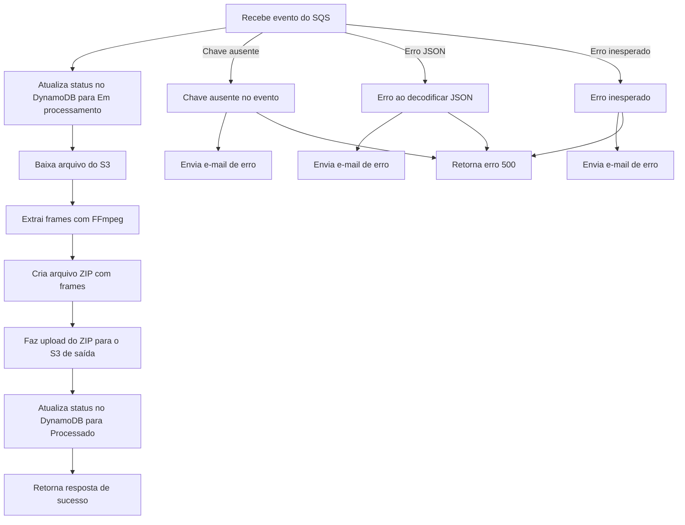

# AWS Lambda para Processamento de Vídeos com Extração de Frames

Esta AWS Lambda tem como objetivo automatizar o processamento de arquivos de vídeo enviados para um bucket S3. A função é acionada por eventos provenientes de uma fila Amazon SQS, realiza o download do arquivo, extrai frames utilizando FFmpeg e disponibiliza os resultados em formato ZIP no S3 de saída.  

---

## 🛠️ Funcionalidades

- **Processamento automatizado de vídeos:**  
  A função recebe eventos do SQS contendo informações do vídeo a ser processado.  
- **Extração de frames com FFmpeg:**  
  Cada vídeo enviado é processado para gerar imagens frame a frame.  
- **Compactação dos frames em ZIP:**  
  Os frames extraídos são compactados para facilitar o armazenamento e compartilhamento.  
- **Upload para S3:**  
  O arquivo ZIP finalizado é enviado para o bucket S3 de saída.  
- **Atualização de status em DynamoDB:**  
  Registra o status de processamento do arquivo no DynamoDB.  
- **Notificação de erros por e-mail:**  
  Em caso de falha, um e-mail de alerta é enviado via Amazon SES.  

---

## Fluxograma



---

## ⚙️ Fluxo de Processamento

1. **Recebimento do evento do SQS:**  
   - A função é acionada quando uma nova mensagem chega na fila SQS.  
   - A mensagem contém o nome do bucket e a chave do arquivo de vídeo.  

2. **Atualização do status no DynamoDB:**  
   - O status do arquivo é atualizado para "Em processamento".  

3. **Download do arquivo do S3:**  
   - O vídeo é baixado para o diretório temporário da Lambda (`/tmp`).  

4. **Extração de frames com FFmpeg:**  
   - Os frames do vídeo são extraídos e armazenados temporariamente.  

5. **Criação do arquivo ZIP:**  
   - Todos os frames são compactados em um único arquivo ZIP.  

6. **Upload do arquivo ZIP para S3:**  
   - O arquivo ZIP é carregado no bucket de saída, na pasta `processed/`.  

7. **Atualização do status para "Processado":**  
   - O status final é atualizado no DynamoDB.  

8. **Resposta de sucesso:**  
   - A Lambda retorna uma resposta indicando o sucesso do processamento.  

---

## 🛡️ Tratamento de Erros

Caso ocorra algum problema durante o processamento, a função captura exceções e executa as seguintes ações:  

- **Erros de chave ausente no evento SQS:**  
  - Envia um e-mail de alerta e retorna erro 500.  

- **Erro ao processar JSON da mensagem:**  
  - Envia uma notificação por e-mail e retorna erro 500.  

- **Falhas inesperadas:**  
  - Notifica via e-mail e encerra o processamento com erro.  

---

## 🧰 Tecnologias Utilizadas

- **AWS Lambda** – Processamento serverless do vídeo.  
- **Amazon SQS** – Fila de mensagens para acionar o processamento.  
- **Amazon S3** – Armazenamento de vídeos de entrada e saída.  
- **Amazon DynamoDB** – Rastreamento do status do processamento.  
- **Amazon SES** – Envio de notificações de erro.  
- **FFmpeg** – Extração de frames dos vídeos.  
- **Python** – Linguagem utilizada na implementação.  

---

## 📦 Implantação

Para implantar esta função Lambda, siga as etapas abaixo:

1. Instale as dependências listadas no `requirements.txt`:  
   ```bash
   pip install -r requirements.txt -t package/